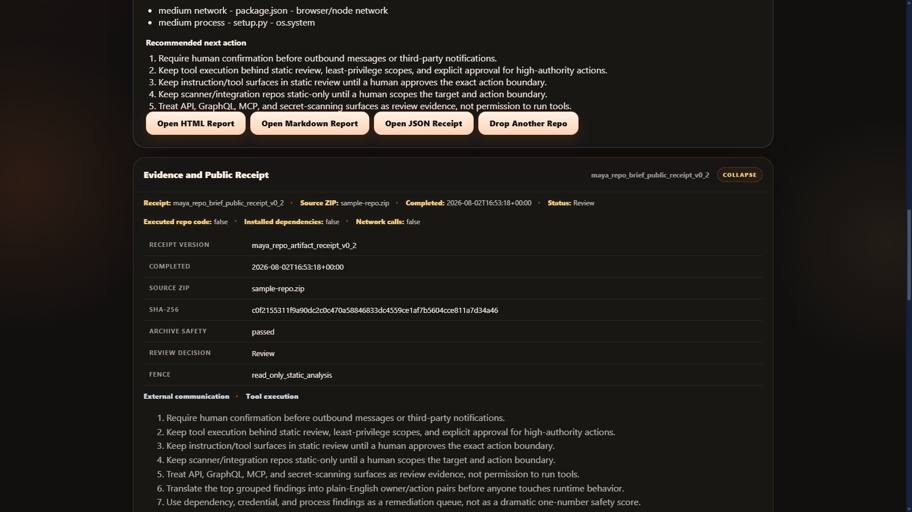

# MAYA Sentinel

**See what's inside a repo before you run it.**

MAYA Sentinel is a local repository ZIP scanner for bounded static analysis. It inspects archive structure and source signals, then produces public-safe Markdown, HTML, and JSON receipts. It never executes repository code, never installs dependencies, and never phones home.

> Sentinel cannot prove that a repository is safe. It identifies static signals that help a human decide what deserves deeper review.



Upload a ZIP and read the decision brief. Every scan runs locally and stays local.

## Scan modes

Pick a focus before you drop the ZIP. Every mode runs the same local static scan; the report just leads with what matters for your question.

| Mode | Question it answers |
|---|---|
| **Safety Scan** | Is this safe to run? Credentials, binaries, install hooks, filesystem and process risk. |
| **Phishing / Impersonation** | Is this a scam? Shortlinks, lookalike domains, scam tracking stacks, credential-harvest and wallet-drainer wording. |
| **Dependency & Supply Chain** | What does this pull in? Dependencies, lockfiles, install hooks, version drift. |
| **AI / Agent Surface** | Does this drive agents? MCP servers, agent instructions, prompts, workflows. |
| **Exfil & Telemetry** | Does this phone home? Webhook endpoints, tracking stacks, data collection. |
| **Archive Safety** | Is the ZIP itself hostile? Traversal, bombs, symlinks, path tricks. |

CLI scans take the same focus flag:

```bash
python maya_lens_server.py --scan path/to/repository.zip --mode phishing
```

## What it catches

- **ZIP traversal, path collision, symlink, device-name, compression-ratio, and extraction-budget hazards**, the archive tricks that hide malware in plain sight
- **Install hooks and dependency manifests**, what runs when you install
- **Credential-shaped values**, with redaction, not exposure
- **Process, filesystem, persistence, binary, and network string surfaces**, what the code reaches for
- **Phishing and brand-impersonation signals**, shortlink funnels, lookalike domains, scam ad/tracking stacks, credential-harvest and wallet-drainer wording, and exfiltration endpoints (built from a real 2026 campaign that mass-mentioned GitHub users and redirected them to a fake `hermes-agent.icu`)
- **Self-declared provenance and reuse signals**, is this actually what it claims to be?
- **AI/component inventory and agent/MCP workflow surfaces**, repo code that drives agents

Public conclusions are deliberately bounded to:

- `No signal detected by this scan`
- `Review`
- `Risk`
- `Blocked`

## Quick start

Requirements: Python 3.11, 3.12, or 3.13.

Windows:

```text
OPEN - MAYA Sentinel.cmd
```

Any supported platform:

```bash
python maya_lens_server.py
```

Open `http://127.0.0.1:5182/` and choose a repository ZIP you are authorized to inspect.

No dependency installation is required.

## Command-line scan

```bash
python maya_lens_server.py --scan path/to/repository.zip
python maya_lens_server.py --scan path/to/repository.zip --mode supply-chain
```

Modes: `safety` (default), `phishing`, `supply-chain`, `ai-surface`, `exfil`, `archive`.

## Why it exists

AI-generated and AI-agent-driven code is everywhere now, and so is the temptation to install first, inspect never. Sentinel is the five-second inspection layer: bounded, local, and honest about what it can and cannot prove. The repo ecosystem is getting faster. Your review process should be, too.

## Verification

Every referenced test ships in this repository:

```bash
python -m py_compile src/maya_lens/*.py maya_lens_server.py
python tests/test_maya_lens_scanner.py
python tests/test_maya_lens_server.py
python tests/test_public_release_contract.py
node --check web/app.js
```

A ready-to-enable GitHub Actions template is included at `docs/ci/verify.yml.example`; local verification remains the release authority.

## Privacy and retention

- Uploaded ZIPs remain local and are removed after each scan attempt
- Raw scan state is memory-only by default
- Only public-projected reports and history metadata are retained locally
- Retained history and reports can be deleted through the UI
- The tool makes no repository network calls and sends no telemetry

## Security boundary

The server binds to loopback and uses Host, Origin, and in-memory session-token checks for mutating requests. It emits CSP, anti-frame, no-sniff, referrer, permissions, COOP, and CORP browser hardening headers.

## License

MIT License. See [LICENSE.txt](LICENSE.txt) for the full terms.

Copyright (c) 2026 2ndNatureAi.
